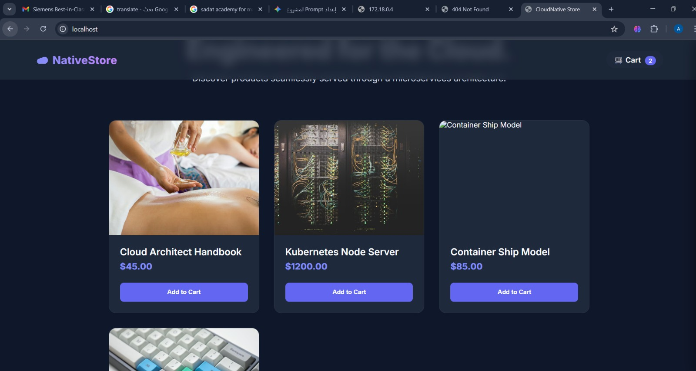
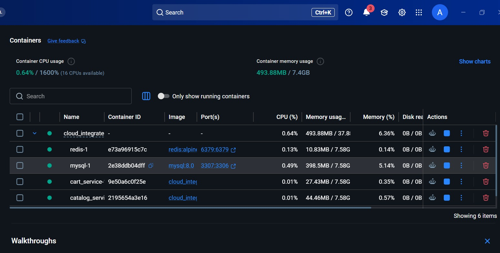
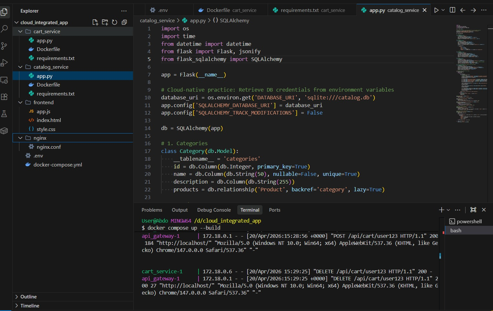
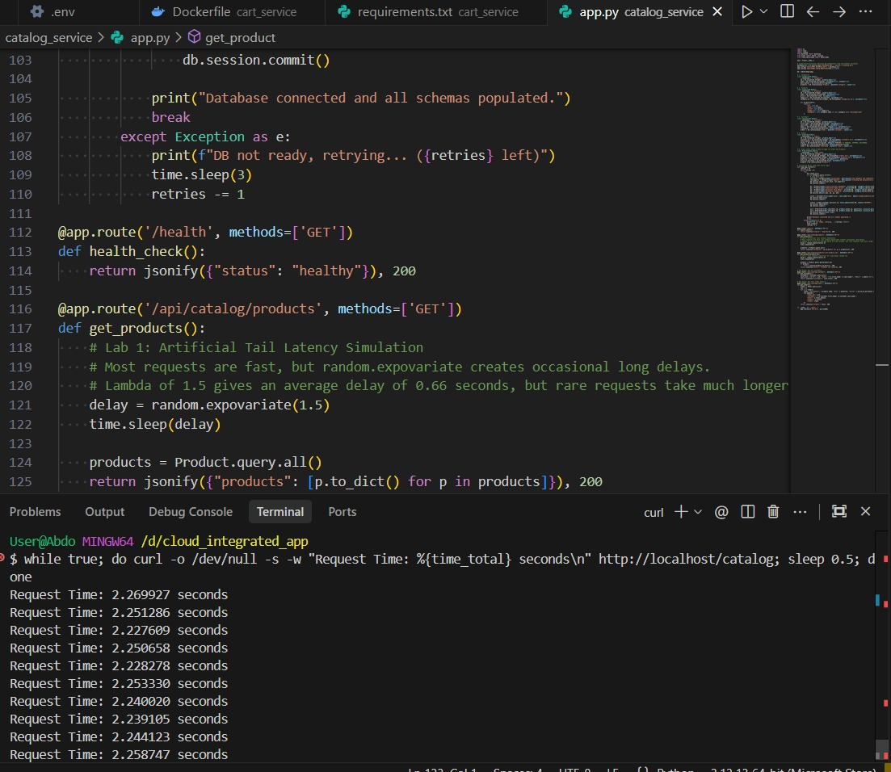
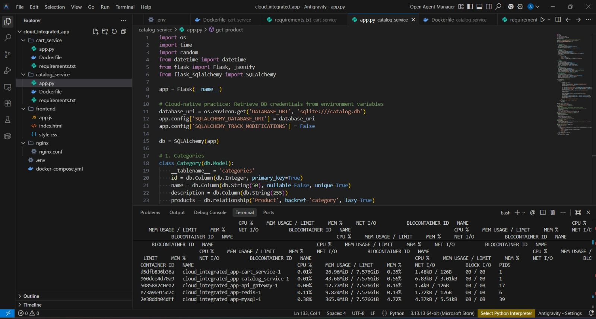

# ☁️ Cloud Integrated E-Commerce System


A fully containerized microservices application designed to handle modern e-commerce operations. This project demonstrates cloud-native principles, utilizing Docker for orchestration, Nginx for reverse proxying, and multiple distinct backend services for robust and scalable performance.

---

## 🏗️ Architecture & Technologies

This system is decoupled into independent microservices, ensuring high availability and fault tolerance:

- **Frontend Interface:** A responsive web application interacting seamlessly with the backend APIs.
- **Catalog Service (Python/Flask):** Manages products, categories, customers, and orders using **SQLAlchemy** for relational database operations. It features artificial tail latency simulation to mimic real-world network variations.
- **Cart Service (Python/Flask):** Handles temporary, high-speed transactions (add/remove/view items) using an in-memory **Redis** data store.
- **API Gateway (Nginx):** Acts as a unified entry point, intelligently routing incoming HTTP traffic (`/api/catalog/*` and `/api/cart/*`) to the respective underlying microservices.

---

## 📂 Project Structure

```text
cloud_integrated_system/
├── cart_service/       # Flask service managing the shopping cart (Redis integration)
├── catalog_service/    # Flask service managing the store database (SQLite/SQLAlchemy)
├── frontend/           # HTML/CSS/JS frontend application
├── nginx/              # Nginx configurations for reverse proxy routing
├── docker-compose.yml  # Multi-container orchestration config
└── .env                # Environment variables (Database URI, Redis Ports, etc.)
```

---

## 🚀 Key Features

1. **Microservices Design:** Separation of concerns between static content serving, relational data management (Catalog), and fast key-value storage (Cart).
2. **Containerized Deployment:** Entire stack spins up with a single Docker Compose command, ensuring environment consistency across development and production.
3. **Resilient Data Seeding:** The catalog service includes automated retry logic to gracefully handle database connection delays upon startup, instantly seeding mock data.
4. **Unified Routing:** Nginx masks the internal microservice complexity, exposing a clean, single-origin API to the frontend.

---

## ⚙️ API Endpoints

### Catalog Service
- `GET /api/catalog/products` - Retrieve all products
- `GET /api/catalog/products/<id>` - Retrieve specific product details
- `GET /api/catalog/customers` - List all registered customers
- `GET /api/catalog/orders` - View all orders and their items
- `GET /health` - Service health check

### Cart Service
- `GET /api/cart/<user_id>` - Fetch cart contents for a user
- `POST /api/cart/<user_id>` - Add items to a user's cart
- `DELETE /api/cart/<user_id>` - Clear a user's cart
- `GET /health` - Service health check and Redis connection status

---

## 📸 Project Showcase & Evaluation Metrics

Here is a visual overview of the application in action, along with system performance and testing metrics:

### 1. Running Application
The fully functional web interface operating through the microservices architecture.


### 2. Docker Containers
A look into the containerized environment showing the isolated running microservices.


### 3. API Testing & Gateway Routing
Successful API tests demonstrating the Nginx gateway correctly routing to backend services.


### 4. Latency Test Results
Validation of the artificial tail latency simulation used to test system resilience.


### 5. Resource Consumption Matrix
Live tracking of system resources, highlighting the efficiency of the containerized setup.


---

## 🛠️ How to Run

1. Ensure **Docker** and **Docker Compose** are installed on your machine.
2. Clone this repository to your local environment.
3. Navigate to the project root directory.
4. Execute the following command to build and run the cluster:
   ```bash
   docker-compose up --build -d
   ```
5. Access the web interface at `http://localhost`.

---

*Engineered for modern cloud infrastructure practices and scalable architecture design.*
